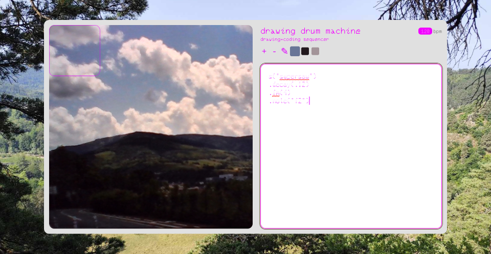

<a href="https://ko-fi.com/jessyasselineau"></a>

# Drawing Drum Machine
**Video-based Strudel editor**

## Wtf is that
The drawing drum machine is a strudel live editor that uses a live video feed to trigger sounds.

It comes as web components for reusability and modularity so you can build your custom ui.

## How can I use it

You need nodejs to use it locally, see how to install it [here](https://nodejs.org/fr/download)

Install it from the node repository with ```npm i drawing-drum-machine```

Then, you just have to load the library, put the different parts in your html file, and voilà !

```import "drawing-drum-machine"```

How it works : 

- ```<ddm-main>``` contains the image processing and live feed part

- ```<ddm-channels>``` contains the channels UI : adding, modifying values, removing, writing code

You have to put these two components in your dom and set a width-height to the ddm-main component otherwise the drawing drum machine will not run. And you'll be sad.

## I want it NOW

You have two options: 

- If you have node already installed on your computer, you can clone the repo, go to the examples directory, install the dependencies and run ```npm run <name-of-the-folder>``` (i.e : _base_ or _hannah_)

- Or you can go to my website [here](https://www.jessyasselineau.fr/ddm)

## I want to pimp it

Just clone the repo and use the _base_ example, it has the very basic blocks of CSS to custom.

If your theme slay af, you can make a pull request to add it to the examples folder.

## How to rave on

- Add a channel with the "+" symbol
- Set the channel color by clicking on the pen then the live feed
- Write the desired code (strudel chain), for example : 
```s("sine").decay(.1).delay(1)```
- Smash your CTRL+S buttons to update the sequence
- DANCE
- Repeat for any new color-instrument you want

## Hidden powers

### bpm

You can set the bpm programaticaly by using the tempo property of the ddm. Like this :

_html_

```
<ddm main id="ddm"></ddm>
```

_js_

```
const ddm = getDocumentById("ddm");
ddm.tempo = <your-value> (as number)
```

It can be cool when paired with a text field to set it on the fly during your live. See examples/hannah for the code.

## How to contribute

As I'm not really a developer myself, ask for features if you are not too, or make some pull requests if you are kind and strong. I will ensure to keep it up to date as long as I can.

### What to do / What is coming

- Save and load patches, to make the rave (litteraly) memorable
- Allow the refresh function to be triggered not only by CTRL+S, allowing mobile users to use it too

## How to support

You can tip me on ko-fi to help me to maintain this repo, or to eat sometimes.

## License
This library is distributed by the terms of the Hippocratic License version 3.0. 

[You can see it here](https://firstdonoharm.dev/version/3/0/full.html)